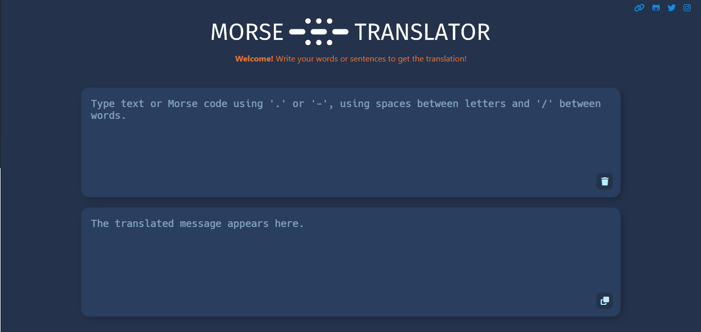

# Morse Translator

## Description

This is a simple Morse translator that can translate from Morse to English and vice versa. You can copy the text from the output box to save time from typing it out.

It is written using HTML, SCSS, and JavaScript.

If the translator can not translate the text, it will display the text as it is.

 

 

## How to use

To use the [Morse Translator](https://nlarrea.github.io/morse-translator/), simply type in the text you want to translate in the input box. The output will be displayed in the output box as soon as you type in the text. You can also copy the text from the output box by clicking the copy button.

 

**Coming soon:**

* [ ] Add a button to listen to the Morse code.
* [ ] Add a button to download the Morse code as an audio file.
* [ ] Add a button to change the text from the output box to the input box.

 

 

## Contact

If you have any doubt or suggestion about the content of this document or any other matter, don't hesitate to contact me from any of these links!

 &emsp;
 &emsp;

